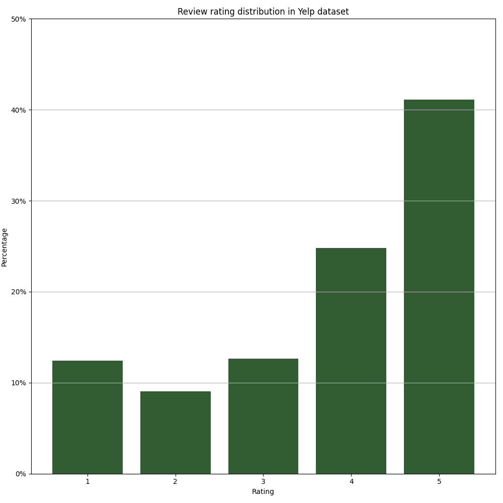

# review-summarizer

An NLP application for summarizing customer reviews.

### An overview of Yelp dataset
Yelp dataset contains **209,393** businesses and **8,021,122** reviews linked to these businesses. In our case, we use business and review datasets of Yelp, and we only consider the "restaurant" data in the business dataset. This corresponds to **63,944** restaurants (**30.5%** of all businesses). There are **5,055,992** reviews for restaurants (**63.0%** of all reviews). So, we can say that restaurants have more reviews compared to other types of businesses. A restaurant has approximately **79** reviews on average.

Each review has a rating (or stars) from **1** to **5**. The rating distribution of reviews is not uniform. The proportion of each rating in the restaurant reviews data is below:

We can see that most of the reviews have ratings **4** and **5**.

## Approach
For extracting the reason for low/high rating of a restaurant, we can use review texts and ratings. Here, only reviews that have a rating lower than or equal to the average rating of a restaurant are used. By looking at the rating distribution, one can argue that low rating-reviews hold more valuable information about a restaurant. After analyzing the outputs, this elimination method seemed useful.

The first step is to find "opinion-feature" pairs in a review text. Here, "feature" denotes an aspect of the restaurant such as ***food***, ***service***, ***pizza***, ***sandwich***, ***ambience***, etc. Similarly, "opinion" is the sentiment of the reviewer about a specific feature of the restaurant. For example, ***nice** food*, ***good** service*, ***delicious** pizza*, ***bad** sandwich*, ***awful** ambience*, etc. To extract opinion-feature pairs from a review text, we can use **dependency parsing**.

#### Dependency parsing to find opinion-feature pairs
Using the latest version of Stanford's CoreNLP dependency parser, one can generate dependency parses and find dependency relations seen in a text. To extract the opinion-feature pairs explained above, we can focus on two specific dependency relations: *nsbuj* and *amod*.

The first one, *nsubj*, refers to the relation between a nominal subject and object. For example, in the sentence "The car is red.", "red" and "car" form an *nsubj* dependency. This relation corresponds to a opinion-feature pair in our context only if the governor (red) is an adjective and dependent (car) is a noun. The first constraint can be applied with the *JJ* (adjective) POS tag and the second one can be applied with *NN* (noun) and *NNS* (noun, plural) POS tags. For more information on *nsubj* relation, see https://universaldependencies.org/en/dep/nsubj.html.

The second one, *amod*, refers to the relation between an adjective or adjectival phrase and a nominal. For example, in the sentence "Sam eats red meat.", "red" and "meat" forms an *amod* dependency. This relation corresponds to a opinion-feature pair in our context only if the governor (meat) is a noun and dependent (red) is an adjective. In the same manner, we can use POS tags to apply these constraints. For more information on *amod* relation, see https://universaldependencies.org/en/dep/amod.html.

With this method, a review can be summarized with opinion-feature pairs like below.
```
input : "I went there yesterday night. The burger was good, the service was okay. They have nice waiters."
output: [("good", "burger"), ("okay", "service"), ("nice", "waiters")]
```

#### Extract the reason from opinion-feature pairs
After collecting opinion-feature pairs from the reviews of a restaurant, first, we look for the most frequent features. Most frequent features can be interpreted as the most significant aspects of a restaurant. Then, after selecting a set of features, we select the most frequent opinion of each feature as the final opinion. This opinion can be regarded as the most significant sentiment stated by the reviewers about that feature. Finally, for a single restaurant, we have a limited number of opinion-feature pairs with distinct features. We expect these pairs to express the reason behind the rating of a restaurant.

**Note**: Top 3 features are used in this implementation.

## Implementation
The implementation consists of two major parts: ```summarizer``` and ```services```.

#### summarizer
```summarizer``` implements a review text summarizer in [summarizer.py](summarizer/summarizer.py) using Stanford's CoreNLP library. The .jar files for CoreNLP library and models is available on https://stanfordnlp.github.io/CoreNLP. A CoreNLP server and a dependency parser can be initialized using Python's ```nltk``` library.

```summarizer``` also contains a [process_reviews.py](summarizer/process_reviews.py). This script accepts Yelp dataset files, .jar files and number of restaurants to be processed as command line arguments. It collects reviews from the dataset and by using the "summarizer" outputs, it extracts "reason" strings for each restaurant. The output is written into a newline-delimited .json file. This output .json file serves as the only source of data for the REST API in later stages.

Lastly, [requirements.txt](summarizer/requirements.txt) lists the Python requirements of ```summarizer```.

#### services
```services``` defines a multi-container structure: a MySQL server and a Flask REST API. [docker-compose.yml](services/docker-compose.yml) describes these two containers and the relation between them.

*mysql_server* is a Docker container built from the image ```mysql:latest```, it contains a database named ```db```.

*flask_server* is a Docker container built by the [Dockerfile](services/Dockerfile). It is a ```python:3.9``` instance. ```flask_server``` copies the source code given in [app](services/app) and runs the REST API. With startup, it loads the restaurants data into MySQL database. The restaurant data is coming from [data/restaurants.json](data/restaurants.json) and it is the output of the previous stage (summarizer).

As it can be seen in [docker-compose.yml](services/docker-compose.yml), *flask_server* has to wait *mysql_server* to become healthy before starting.

Once the REST API is up and running, it serves on ```http://localhost:5000``` and it receives the GET request on the endpoint ```http://localhost:5000/restaurants```. Example request: ```http://localhost:5000/restaurants?category=burgers```.

The source code in ```app```, contains the Flask application, Python modules holding MySQL/data loading functions and unit tests for testing REST API functionalities.

Lastly, [requirements.txt](services/requirements.txt) lists the Python requirements of the Flask application.

## Run
First go to *services* directory:
```bash
cd services
```

Build the containers:
```bash
docker-compose build
```

Run the containers:
```bash
docker-compose up
```
**Note**: Before running the containers, please make sure that no other application is using port 5000 or port 3306.

After both containers are up running, you can access the REST API on ```http://localhost:5000```. REST API provides the needed functionality on ```/restaurants``` endpoint. You can send a GET request as the following: ```http://localhost:5000/restaurants?category=italian```. REST API will return a JSON object with ```restaurants``` as its only key and an array of restaurant objects in it. For now, REST API will use previously generated restaurants data of **1000** restaurants in ```data/restaurants.json```.

Also, you can run unit tests for testing the REST API. Run:
```bash
python app/test.py
```

#### Running the summarizer
First go to *summarizer* directory:
```bash
cd summarizer
```

Install Python requirements:
```bash
pip install -r requirements.txt
```

You will need Stanford's CoreNLP and Yelp dataset files to run the summarizer. I made these files available on Google Drive for testing purposes. You can download the .tar.gz file including these files with this [link](https://drive.google.com/file/d/1A1eWmMYKZZ46fTYaMAND6krkMKhBgkAj/view?usp=sharing). Move the downloaded .tar.gz file into *summarizer* directory and extract it:
```bash
tar -xzf data.tar.gz
```
The extracted *data* directory will contain the required files.

Next, you will need to run the script *process_reviews.py*. The command line arguments are explained below:
```text
optional arguments:
  -h, --help            show this help message and exit
  -ybd , --yelp-bus-data
                        Filepath to Yelp business dataset (default: data/sample_business.json)
  -yrd , --yelp-rew-data
                        Filepath to Yelp review dataset (default: data/sample_review.json)
  -sj , --stan-jar      Filepath to Stanford CoreNLP .jar file (default: data/stanford-corenlp-4.2.0.jar)
  -smj , --stan-models-jar
                        Filepath to Stanford models .jar file (default: data/stanford-corenlp-4.2.0-models.jar)
  -n , --n-restaurants
                        Number of restaurants to process (default: 100)
  -o , --out            Filepath for saving the output file (in output directory) (default: restaurants.json)
```
Default values are already pointing to files located in extracted *data* directory.

Run the summarizer for **100** restaurants:
```bash
python process_reviews.py -n 100
```

It will take couple of minutes to process reviews belonging to **100** restaurants, approximately **8000** reviews.

The output file will be located at ```output/restaurants.json```.

## Further works
 - Parallelization of summarizer pipeline. Due to time constraints, I couldn't develop a parallelized version of the summarizer. This would decrease the processing time needed to process review texts significantly. In this way, we can generate results for all the restaurants given in Yelp dataset in a reasonable time.
 - A better feature selection. With the current approach, if features of a restaurant have the same frequency in the reviews, the algorithm basically makes a random choice among them. This is not ideal. After analyzing the overall counts of features in all reviews, we can choose the more meaningful features even when the frequency is the same for a restaurant.
 - A better opinion selection. With the current approach, there is a similar "random choosing" problem for opinions when the frequency of opinions is the same. To improve our selection approach, we can try to form 2 (negative, positive) or 3 (negative, neutral, positive) sentiment clusters from opinions. Then we can randomly select from the most crowded sentiment cluster. This would guarantee that we will see an opinion in parallel with most of the reviews.
 - Lemmatization of features. By applying lemmatization to features, we can get rid of distinct features that refer to the same aspect of the restaurant, i.e. "waiter" and "waiters".
